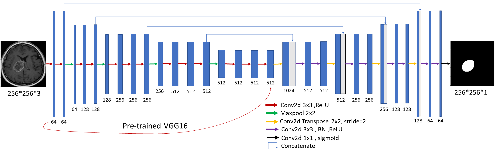
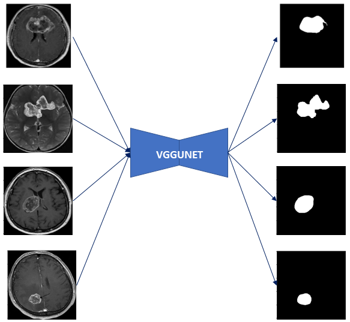
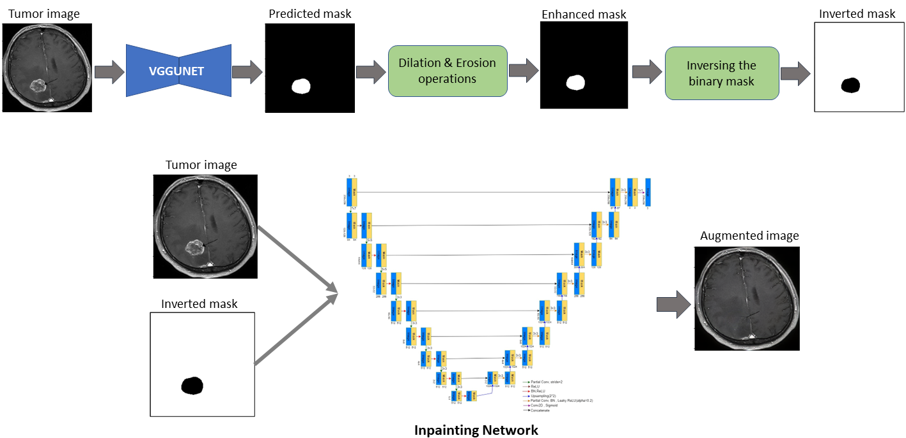
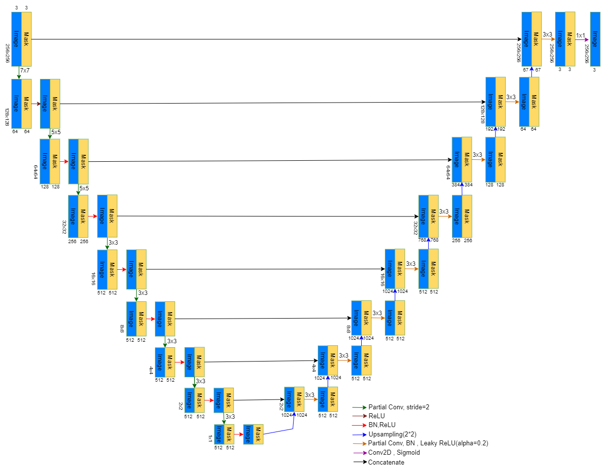
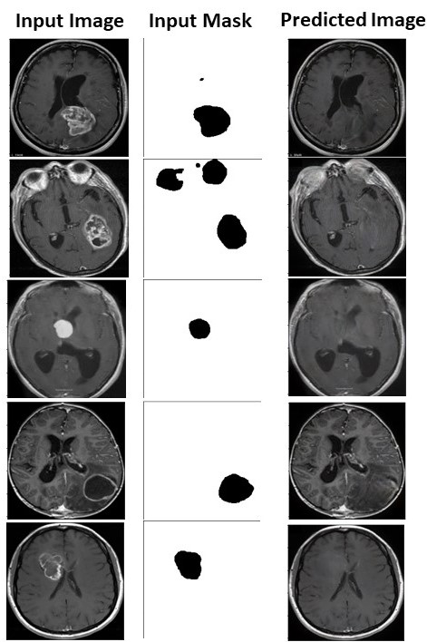
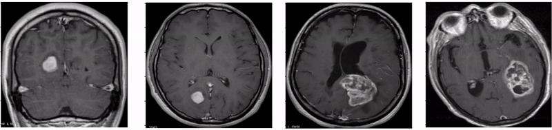
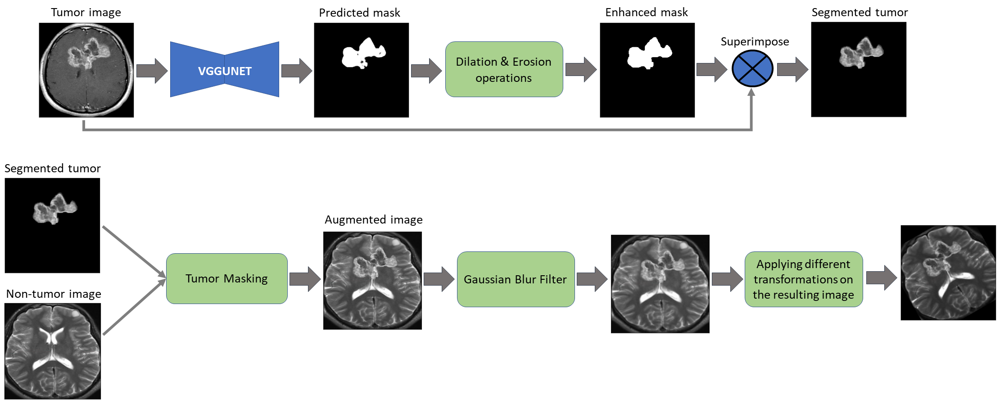

# RegionInpaint, Cutoff and RegionMix: Introducing novel augmentation techniques for enhancing the generalization of brain tumor identification.

## Abstract
Introducing novel augmentation techniques named RegionInpaint, Cutoff and RegionMix augmentation techniques for enhancing the generalization of brain tumors classification.


## Segmentation using VGGUNET
The VGGUNET is similar to U-Net. However, it uses a pre-trained VGG16 network on the ImageNet dataset without its fully connected layers as its encoder. The main advantage of replacing the default encoder of U-Net with a pretrained network is to enable the segmentation model to produce better features and hence, enhance the overall segmentation results. This also, helps the segmentation model to converge faster. The figure below shows the full network of VGGUNET

<p align="center">
  
 </p>

### :rocket: How to Run!

```
python Segmentation/segmentation_main.py --train_data [training images folder path] --train_annot [training annotation folder path] \ 
--val_data [validation images folder path] --val_annot [validation annotation folder path] \
--image_size 256 --lr 0.00001 --epochs 90 --batch_size 2 --pretrained_weights [pretrained model path if exist]
```
### VGGUNET Qualitative Results
Some sample images and their corresponding predicted masks obtained from VGGUNET model

<p align="center">
  
 </p>

## RegionInpaint Augmentation.
The figure below illustrates the steps of applying the proposed RegionInpaint augmentation technique. First, segmentation is applied to the training images. The goal of applying segmentation is to generate binary masks for our training images where the white pixels in the binary mask correspond to the tumor area while the black pixels correspond to the non-tumor area. Afterwards, a set of dilation and erosion operations are applied to the generated masks to fill any holes that may result due to the segmentation. These binary masks are then inverted such that the black pixels correspond to the tumor area. Lastly, each inverted mask is fed to the inpainting network along with its corresponding original image. The inverted mask is used as the input mask for the inpainting network. The goal of the inpainting network is to fill the pixels in the input image that correspond to the black pixels in the given mask. This corresponds to filling the tumor area with a realistic non-tumor area. In this way the data is augmented by transferring the tumor images to non-tumor images and thus increasing the number of samples in the “non-tumor class”. 
<br/>

<p align="center">
  
 </p>

## Image Inpainting Network.
The inpainting method used in this proposed augmentation is mainly based on the method introduced by Liu G et al. The figure below illustrates the used archeticure and its main blocks

<p align="center">
  
 </p>

### :rocket: How to Run!
### For training:
For training, the batch normalization layer is not freezed (BN is set to true), the learning rate is set to 1e-4
```
python "Image inpainting"\inpainting_main.py --train_dir [training images folder path]\
--validation_dir [validation images folder path] --training_option train --IMAGE_SIZE 256 --batch_size 4 \
--epochs 20 --steps_per_epoch 400 --validation_steps 250
```

### For finetuning:
For finetuning, the batch normalization layer is freezed (BN is set to false), the learning rate is set to 1e-5
```
python "Image inpainting"\inpainting_main.py --train_dir [training images folder path]\
--validation_dir [validation images folder path] --training_option finetune --IMAGE_SIZE 256 --batch_size 4\
--epochs 20 --steps_per_epoch 400 --validation_steps 250 --pretrained_model_path [pretrained model path]
```

### RegionInpaint Qualitative Results
Some sample input images along with their corresponding segmentation masks obtained from VGGUNET model that highlight the tumor region and the inpainting model results

<p align="center">
  
 </p>
This GIF also shows some examples for RegionInpaint Augmentation
<p align="center">
  
 </p>
 
## Cutoff Augmentation.

The proposed Cutoff augmentation approach is based on randomly selecting two images, one from the “tumor class” and the other from the “non-tumor class”. This figure illustrates the steps for applying this augmentation technique. The first step is applying segmentation on the tumor image to obtain its corresponding mask where the white pixels in the predicted mask represents the tumor region. Afterwards, a set of dilations and erosions are applied to the predicted mask to fill any small holes that may result due to the segmentation step. The predicted mask is then superimposed with the original image to obtain the segmented tumor. This segmented tumor is copied to the non-tumor image to obtain a new augmented image. Hence, by this augmentation approach we are able to increase the number of images in the “tumor class”. Finally, Gaussian blur filter is applied on the resulting image and thus enabling the copied tumor to blend with the background. Moreover, different transformations are applied such as rotation, flipping, adjusting brightness and darkness in order to make the tumor in the resulting image look different from the tumor in the original image and accordingly increasing the variety of the training samples. 

<p align="center">
  
 </p>

## RegionMix Augmentation

The proposed RegionMix augmentation is based mainly on segmentation and MixUp approach, where the region of interest (i.e., tumor region) is first extracted from a tumor image through a segmentation network and then mixed with a non-tumor image. The Mixup approach has been introduced by Zhang et al. (2017). This figure illustrates the steps of applying the proposed RegionMix augmentation technique. Similar to the Cutoff augmentation technique, two random images are selected where the first image belongs to the “tumor class” and the second one belongs to the “non-tumor class”. The segmented tumor from the first image is mixed up with the pixels that share the same tumor location in the second non-tumor image. The newly generated image is considered in-between both classes. Finally, different transformations are applied to the resulting image

<p align="center">
  
 </p>

## 📧 Contact

If you have any question, please email `omarsherif0200@gmail.com` or `omarsherif@cis.asu.edu.eg`.

## License
This project is released under the MIT license. Please see the [LICENSE](License) file for more information.
