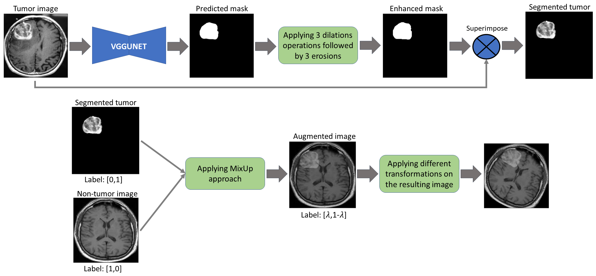

# RegionInpaint, Cutoff and RegionMix: Introducing novel augmentation techniques for enhancing the generalization of brain tumor identification.

## Abstract
Introducing novel augmentation techniques named RegionInpaint, Cutoff and RegionMix augmentation techniques for enhancing the generalization of brain tumors classification.


## Segmentation using VGGUNET


<p align="center">
  
 </p>

### :rocket: How to Run!

```
python Segmentation/segmentation_main.py --train_data [training images folder path] --train_annot [training annotation folder path] \ 
--val_data [validation images folder path] --val_annot [validation annotation folder path] \
--image_size 256 --lr 0.00001 --epochs 90 --batch_size 2 --pretrained_weights [pretrained model path if exist]
```
### VGGUNET Qualitative Results
Some sample images and their corresponding predicted masks obtained from VGGUNET model

<p align="center">
  
 </p>

## RegionInpaint Augmentation.

<br/>

<p align="center">
  
 </p>

## Image Inpainting Network.

<p align="center">
  
 </p>

### :rocket: How to Run!
### For training:
For training, the batch normalization layer is not freezed (BN is set to true), the learning rate is set to 1e-4
```
python "Image inpainting"\inpainting_main.py --train_dir [training images folder path]\
--validation_dir [validation images folder path] --training_option train --IMAGE_SIZE 256 --batch_size 4 \
--epochs 20 --steps_per_epoch 400 --validation_steps 250
```

### For finetuning:
For finetuning, the batch normalization layer is freezed (BN is set to false), the learning rate is set to 1e-5
```
python "Image inpainting"\inpainting_main.py --train_dir [training images folder path]\
--validation_dir [validation images folder path] --training_option finetune --IMAGE_SIZE 256 --batch_size 4\
--epochs 20 --steps_per_epoch 400 --validation_steps 250 --pretrained_model_path [pretrained model path]
```

### RegionInpaint Qualitative Results
Some sample input images along with their corresponding segmentation masks obtained from VGGUNET model that highlight the tumor region and the inpainting model results

<p align="center">
  
 </p>

## Cutoff Augmentation.

<p align="center">
  
 </p>

## RegionMix Augmentation

<p align="center">
  
 </p>

## 📧 Contact

If you have any question, please email `omarsherif0200@gmail.com` or `omarsherif@cis.asu.edu.eg`.

## License
This project is released under the MIT license. Please see the [LICENSE](License) file for more information.
